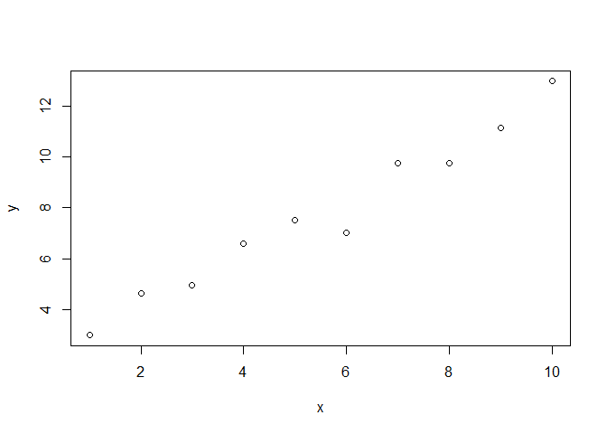

Programming Background
================
Jason Osborne

## My programming experience

In graduate school, I asked my colleague Ed, repeatedly, “Hey Ed, how do
you do this?” We saw each other a couple of months ago for the first
time in about 15 years. He was in Chapel Hill for a conference and we
had burritos at Carrburritos. It was good.

## R Markdown output

``` r
x <- 1:10
y <- 2+x+rnorm(10)
plot(x,y)
```

<!-- -->
