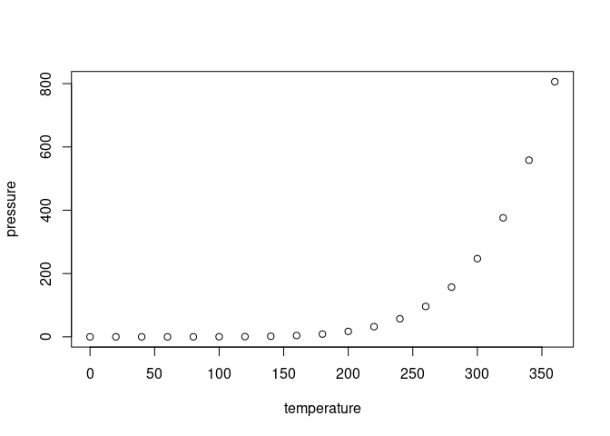

2023-07-14-ProgBGBlogpost
================
Jason Osborne
2023-07-14

## Programming Background

I have been using SAS for, omg, 30 years, mostly for analyzing data. I
also use R to develop and disseminate statistical methodology. In
particular, I have written an R package available on CRAN called
`hiddenf` and have written a publication based on a *shiny* app I’ve
written called `MLBDecideR`.

## Including Plots

Here is a plot!

``` r
plot(pressure)
```

<!-- -->

Here is the render code used to generate the files to make this blogpost
visible.

``` r
rmarkdown::render("2023-07-14-ProgBGBlogpost.Rmd",output_format="github_document",output_dir="../_posts/",output_options=list(keep_html=FALSE))
```
