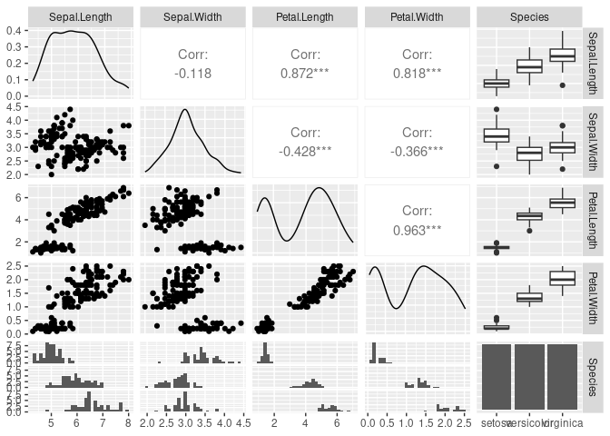

2023-07-19-testblog3
================
Jason Osborne
2023-07-19

``` r
library(formatR)
knitr::opts_chunk$set(echo = TRUE, fig.path="../images/")
```

## Blog test

Making sure I can images to appear correctly in my blogs

``` r
library(GGally)
ggpairs(iris)
```

    ## plot: [1,1] [=>---------------------------------------------------] 4% est: 0s
    ## plot: [1,2] [===>-------------------------------------------------] 8% est: 0s
    ## plot: [1,3] [=====>-----------------------------------------------] 12% est: 0s
    ## plot: [1,4] [=======>---------------------------------------------] 16% est: 0s
    ## plot: [1,5] [==========>------------------------------------------] 20% est: 0s
    ## plot: [2,1] [============>----------------------------------------] 24% est: 0s
    ## plot: [2,2] [==============>--------------------------------------] 28% est: 0s
    ## plot: [2,3] [================>------------------------------------] 32% est: 0s
    ## plot: [2,4] [==================>----------------------------------] 36% est: 0s
    ## plot: [2,5] [====================>--------------------------------] 40% est: 0s
    ## plot: [3,1] [======================>------------------------------] 44% est: 0s
    ## plot: [3,2] [========================>----------------------------] 48% est: 0s
    ## plot: [3,3] [===========================>-------------------------] 52% est: 0s
    ## plot: [3,4] [=============================>-----------------------] 56% est: 0s
    ## plot: [3,5] [===============================>---------------------] 60% est: 0s
    ## plot: [4,1] [=================================>-------------------] 64% est: 0s
    ## plot: [4,2] [===================================>-----------------] 68% est: 0s
    ## plot: [4,3] [=====================================>---------------] 72% est: 0s
    ## plot: [4,4] [=======================================>-------------] 76% est: 0s
    ## plot: [4,5] [=========================================>-----------] 80% est: 0s
    ## plot: [5,1] [============================================>--------] 84% est: 0s
    ## `stat_bin()` using `bins = 30`. Pick better value with `binwidth`. plot: [5,2]
    ## [==============================================>------] 88% est: 0s `stat_bin()`
    ## using `bins = 30`. Pick better value with `binwidth`. plot: [5,3]
    ## [================================================>----] 92% est: 0s `stat_bin()`
    ## using `bins = 30`. Pick better value with `binwidth`. plot: [5,4]
    ## [==================================================>--] 96% est: 0s `stat_bin()`
    ## using `bins = 30`. Pick better value with `binwidth`. plot: [5,5]
    ## [=====================================================]100% est: 0s

<!-- -->

BTW, the render code to generate the .md file is shown below, but not
executed when this file is knitted/rendered.

``` r
library(rmarkdown)
rmarkdown::render("2023-07-19-testblog3",
                  output_format="github_document",output_dir="../_posts/",
                  output_options=list(keep_html=FALSE)) 
```

The end.
